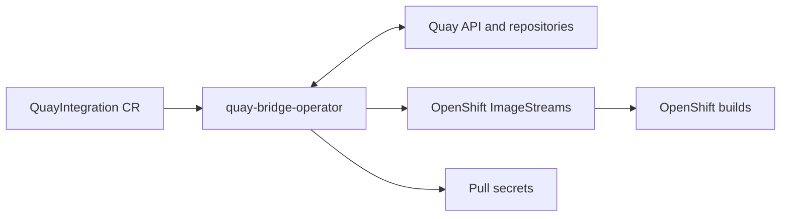

# quay-bridge-operator Architecture

## Purpose

Integrate Quay with OpenShift ImageStreams and builds.



## High-Level Design

```
QuayIntegration CR
    ↓
quay-bridge-operator
    ↓ Sync
Quay repos ↔ ImageStreams
    ↓ Trigger
OpenShift Builds
```

## Components

### `/api/v1alpha1`
CRD definitions:
- `QuayIntegration`: Main CR for Quay-OpenShift integration
  - Quay org/namespace to sync
  - ImageStream naming strategy
  - Secret synchronization config

### `/controllers`
Reconciliation logic:
- `quayintegration_controller.go`: Main reconciler
- Sync Quay repos → ImageStreams
- Sync Quay secrets → OpenShift Secrets
- Trigger builds on image push

## Sync Flow

```
1. QuayIntegration CR created:
   apiVersion: quay.redhat.com/v1alpha1
   kind: QuayIntegration
   metadata:
     name: quay-sync
   spec:
     quayOrganization: myorg
     credentialsSecret: quay-token
     insecureRegistry: false

2. Operator queries Quay API:
   GET https://quay.io/api/v1/repository?namespace=myorg

3. For each repo:
   a. Create/update ImageStream in current namespace
      name: quay-myorg-<reponame>
      tags: [latest, v1.0.0, ...]
   b. Import image tags (oc import-image equivalent)

4. Watch Quay webhooks (if configured):
   Quay push event → operator updates ImageStream → triggers OpenShift Build

5. Sync Quay robot account secrets:
   Quay robot → OpenShift Secret (type: dockerconfigjson)
```

## ImageStream Mapping

```
Quay repo: quay.io/myorg/app
    ↓
OpenShift ImageStream:
  name: quay-myorg-app
  tags:
    - name: latest
      from: quay.io/myorg/app:latest
    - name: v1.0.0
      from: quay.io/myorg/app:v1.0.0
```

## Secret Synchronization

```
Quay robot account: myorg+builder
    ↓
OpenShift Secret:
  name: quay-myorg-builder
  type: kubernetes.io/dockerconfigjson
  data:
    .dockerconfigjson: <base64-encoded-creds>

Linked to ServiceAccount:
  - For pulling (ImagePullSecrets)
  - For building (BuildConfigs)
```

## Build Triggering

```
1. Image pushed to Quay: quay.io/myorg/base:v2.0.0

2. Quay webhook → operator

3. Operator updates ImageStream tag

4. ImageStream change triggers BuildConfig:
   apiVersion: build.openshift.io/v1
   kind: BuildConfig
   spec:
     triggers:
       - type: ImageChange
         imageChange:
           from:
             kind: ImageStreamTag
             name: quay-myorg-base:v2.0.0

5. Build executes, pushes result to Quay
```

## Reconciliation Loop

```
Every 5 minutes (or on CR change):
1. Fetch repos from Quay org
2. Compare with existing ImageStreams
3. Create missing ImageStreams
4. Update changed ImageStreams (new tags)
5. Delete ImageStreams for deleted repos (if pruning enabled)
6. Sync secrets (if changed in Quay)
7. Update QuayIntegration.status
```

## Configuration

```yaml
apiVersion: quay.redhat.com/v1alpha1
kind: QuayIntegration
metadata:
  name: example
spec:
  quayOrganization: myorg
  credentialsSecret: quay-creds
  insecureRegistry: false
  scheduledImageStreamImport: true
  importCredentialsSecret: quay-pull-secret
```

## Status Reporting

```yaml
status:
  lastSyncTime: "2026-06-24T12:00:00Z"
  syncedRepositories: 42
  conditions:
    - type: Ready
      status: "True"
      reason: SyncComplete
```

## Performance

- Batched ImageStream updates
- Incremental sync (only changed repos)
- Rate limiting to Quay API
- Webhook-based updates (no polling)
